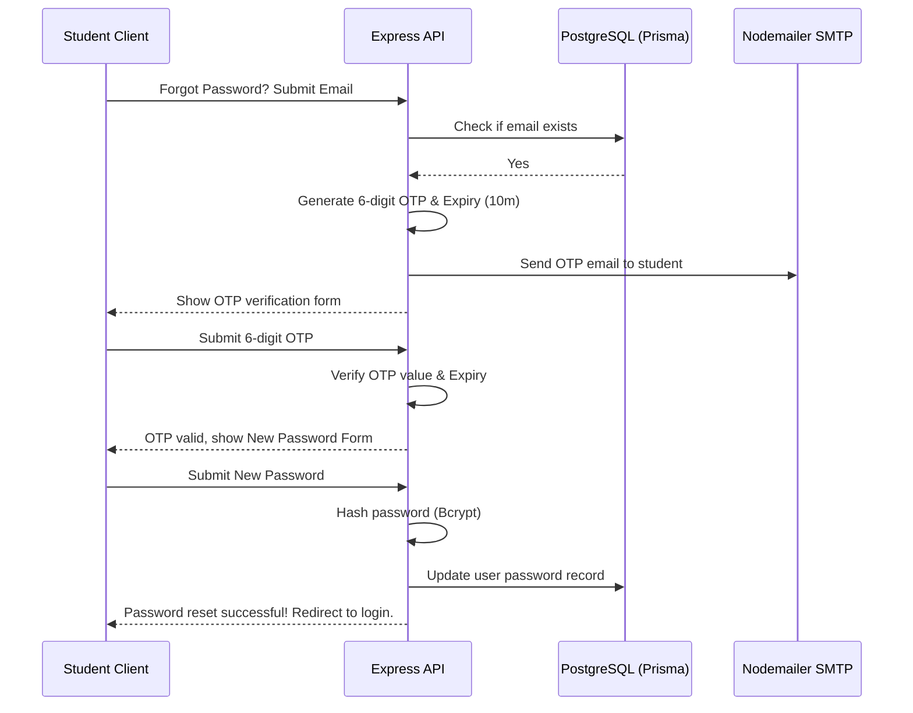
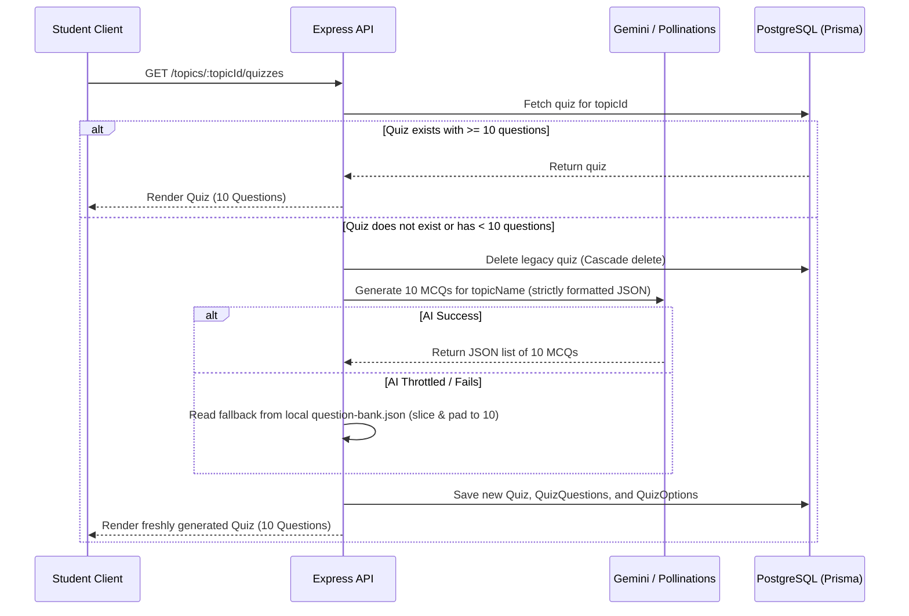
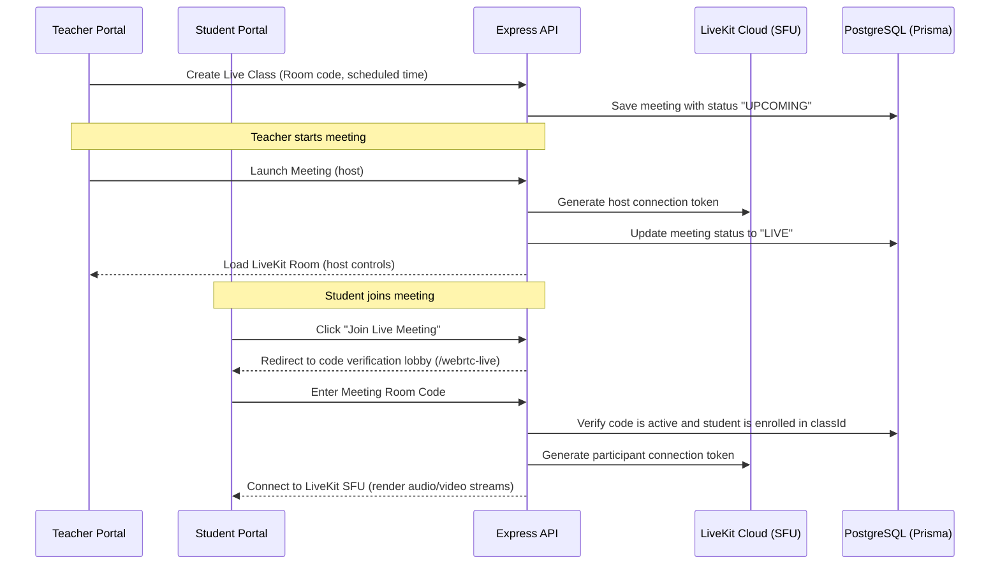
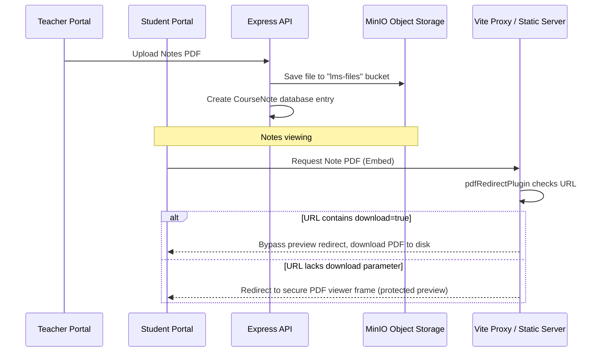

# Nexora Learning Platform - Key System Workflows

This document outlines the core workflows inside the Nexora codebase. Use this to walk your team through how frontend interactions, backend services, and databases interact to power these features.

---

## 1. Authentication & OTP Reset Workflow

---

## 2. Dynamic Quiz Generation Workflow

When a student clicks "Topic Quiz" for the first time, this flow generates questions dynamically.

---

## 3. WebRTC Live Classroom Workflow

How teachers host and students securely join live classes.

---

## 4. Secure Notes & Document Workflow

Explains the upload, preview, and download flow.

